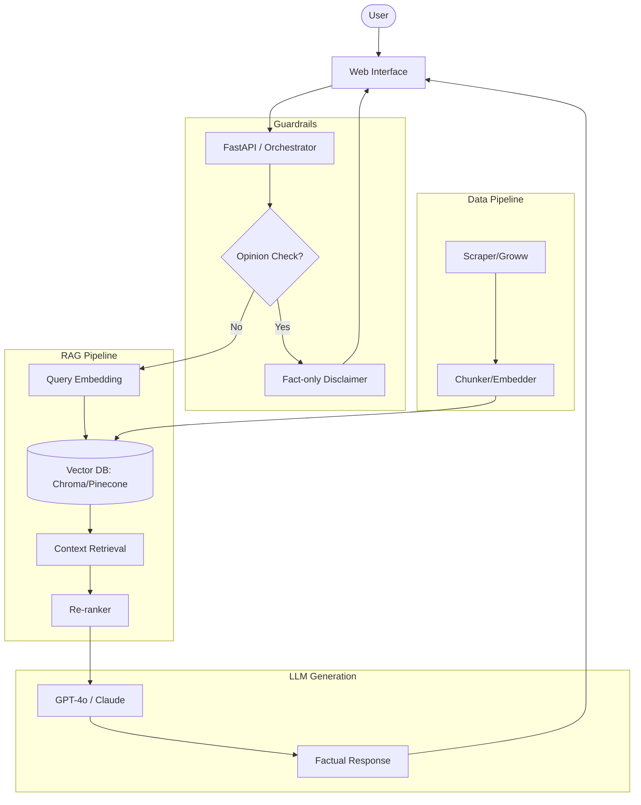

# Technical Architecture: Tata Mutual Fund RAG Chatbot (Groww Prototype)

## 1. System Overview
This document outlines the architecture for a Retrieval-Augmented Generation (RAG) chatbot designed to provide factual information about specific Tata Mutual Fund schemes available on Groww. The system is engineered for accuracy, focusing exclusively on factual data points (expense ratio, lock-in period, SIP amounts, etc.) while explicitly rejecting opinionated queries.

### Objectives
- **Accuracy**: Provide up-to-date factual data from specific scheme pages.
- **Guardrails**: Prevent the LLM from giving investment advice or opinions.
- **Latency**: Ensure fast retrieval and response generation.
- **Scoping**: Limit knowledge base to selected Tata Mutual Fund schemes.

---

## 2. Phase-Wise Architecture

### Phase 1: Data Ingestion & Preprocessing
This phase involves extracting data from the target URLs and transforming it into a machine-readable format.

- **Data Sources**:
  - [Tata Large Cap Fund](https://groww.in/mutual-funds/tata-large-cap-fund-direct-growth)
  - [Tata Flexi Cap Fund](https://groww.in/mutual-funds/tata-flexi-cap-fund-direct-growth)
  - [Tata ELSS Tax Saver Fund](https://groww.in/mutual-funds/tata-elss-fund-direct-growth)
  - [Tata Multicap Fund](https://groww.in/mutual-funds/tata-multicap-fund-direct-growth)
- **Extraction Strategy**:
  - Web scraping using `Playwright` or `BeautifulSoup` to capture key data fields (NAV, Expense Ratio, Min SIP, Exit Load, Riskometer).
  - Periodic scheduling (e.g., daily) to ensure data freshness.
- **Text Chunking**:
  - Semantic chunking to keep relevant context together (e.g., "Exit Load" details as one chunk).
  - Overlap: 10-15% to maintain continuity between chunks.

### Phase 2: Vector Indexing & Storage
Storing the processed data in a high-performance vector database.

- **Embeddings Model**: `text-embedding-3-small` (OpenAI) or `bge-small-en-v1.5` (Hugging Face) for cost-efficiency and performance.
- **Vector Database**: `ChromaDB` (local/prototyping) or `Pinecone` (managed/production).
- **Metadata Tagging**: Each chunk will be tagged with `scheme_name` and `data_category` (e.g., `tax_implications`, `fund_details`) to enable filtered searches.

### Phase 3: Retrieval & RAG Pipeline
Optimizing how the system finds relevant information.

- **Retrieval Strategy**:
  - **Hybrid Search**: Combining Vector Similarity (Semantic) with Keyword Search (BM25) for high-precision fact retrieval.
  - **Re-ranking**: Use a Cross-Encoder (e.g., `bge-reranker-base`) to re-score the top 5-10 retrieved chunks before passing them to the LLM.
- **Prompt Engineering**:
  - Context Injection: "Based on the following factual data from Tata Mutual Fund, answer the user's question..."
  - Strict Instruction: "Do not provide investment advice. Only answer based on the provided text."

### Phase 4: LLM Orchestration & Guardrails
The "brain" of the assistant and its safety checks.

- **Core LLM**: `GPT-4o-mini` or `Claude 3.5 Sonnet`.
- **Conversation Management**: `LangChain` or `LlamaIndex`.
- **Facts-Only Guardrail**:
  - System prompt includes a strict "Facts-Only" persona.
  - **Input Guardrail**: Detect opinion keywords (e.g., "should I", "best", "good") using a classifier or a simple keyword-based filter.
  - **Output Guardrail**: If the model detects an opinion-seeking query, it must return a standard disclaimer: *"I am a factual assistant. I can only provide fund details. Please consult a financial advisor for investment advice."* + [Educational Link](https://groww.in/blog/how-to-invest-in-mutual-funds).

### Phase 5: UI Layer & API
The interface for user interaction.

- **Backend**: `FastAPI` (Python) for asynchronous performance.
- **Frontend**: `React` (Next.js) or `Streamlit` for a quick prototype.
- **User Flow**:
  1. User asks a question (e.g., "What is the exit load of Tata Multicap Fund?").
  2. Input Guardrail checks for opinionated keywords.
  3. API triggers retrieval from Vector DB.
  4. LLM processes top-ranked chunks.
  5. UI displays the factual answer with a source citation.

---

## 3. High-Level System Diagram (Mermaid)

---

## 4. Key Components Summary
| Component | Technology Recommendation |
| :--- | :--- |
| **Orchestration** | LangChain / LlamaIndex |
| **Vector DB** | Pinecone / ChromaDB |
| **Embeddings** | Gemini Embedding Model / text-embedding-3-small |
| **LLM** | Google Gemini (1.5 Flash / Pro) |
| **Scraping** | Playwright / BeautifulSoup |
| **API** | FastAPI |
| **Frontend** | Streamlit (Prototype) / React (Production) |
